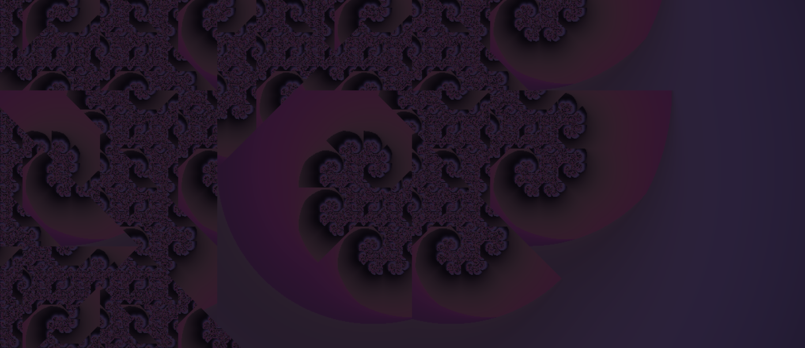
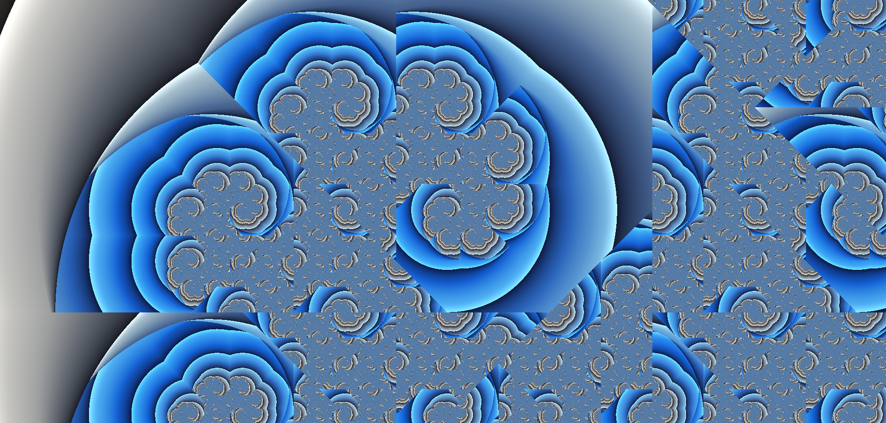

# Twindragon Fractal

Real-time, infinitely-deep WebGL exploration of the **twindragon** — a plane-filling
fractal tile generated by counting in base $1+i$.

Three renderers share one shader core: a self-driving cinematic zoom with narration,
a mouse-driven explorer, and a re-colored "sapphire" variant. Plus two Manim
animations that build the fractal from first principles.

<!-- SCREENSHOTS -->
| Violet / Rose | Sapphire |
| :---: | :---: |
|  |  |

---

## Table of contents

- [The mathematics](#the-mathematics)
  - [An iterated function system](#1-an-iterated-function-system)
  - [Counting in base 1 + i](#2-counting-in-base-1--i)
  - [Dimension: area 2, boundary 1.5236…](#3-dimension-area-2-boundary-15236)
  - [Rendering by inverse iteration](#4-rendering-by-inverse-iteration)
  - [What the color bands actually measure](#5-what-the-color-bands-actually-measure)
- [Deep zoom without losing precision](#deep-zoom-without-losing-precision)
- [Fighting aliasing at the boundary](#fighting-aliasing-at-the-boundary)
- [The two color schemes](#the-two-color-schemes)
- [Manim animations](#manim-animations)
- [Files](#files)
- [Running it](#running-it)
- [Deployment](#deployment)
- [Credits](#credits)

---

## The mathematics

### 1. An iterated function system

The twindragon is the unique compact set $T \subset \mathbb{C}$ fixed by a pair of
contracting similarities:

$$
\varphi_0(z) = \frac{z}{1+i}, \qquad
\varphi_1(z) = \frac{z+1}{1+i}, \qquad
T = \varphi_0(T) \cup \varphi_1(T).
$$

Each map scales by $|1+i|^{-1} = 1/\sqrt{2}$ and rotates by $-45^\circ$. By Hutchinson's
theorem the *attractor* $T$ exists, is unique, and is reached from **any** nonempty
starting set: iterate $A_n = \varphi_0(A_{n-1}) \cup \varphi_1(A_{n-1})$ and
$A_n \to T$ in the Hausdorff metric. Start from a single point and you get the
$2^n$-point clouds animated in [`manim/`](manim).

### 2. Counting in base $1+i$

Unrolling the recursion gives the twindragon's arithmetic identity. Every point of $T$
is a "fraction" written in base $1+i$ with binary digits:

$$
T = \left\{ \sum_{k=1}^{\infty} \frac{d_k}{(1+i)^{k}} \;:\; d_k \in \{0,1\} \right\}
$$

This is why the shape matters beyond being pretty. $\{0,1\}$ is a complete residue
system mod $1+i$ in the Gaussian integers $\mathbb{Z}[i]$, so $T$ is the **fundamental
domain** of that numeration system: it has area exactly 1, and its $\mathbb{Z}[i]$-translates
tile the plane with no gaps and no overlaps of positive measure. It is also a
*rep-tile* — two copies of $T$, each shrunk by $1/\sqrt{2}$ and turned $45^\circ$,
reassemble into $T$ itself. That exact self-reproduction is the reason zooming never
runs out of structure.

Geometrically, $T$ is two Heighway dragon curves joined back-to-back — hence
*twin*dragon.

### 3. Dimension: area 2, boundary 1.5236…

Two maps of ratio $1/\sqrt{2}$ satisfying the open set condition give similarity
dimension

$$
\dim_H T = \frac{\log 2}{\log \sqrt{2}} = 2,
$$

so the tile is genuinely two-dimensional — it has interior, and the dark regions on
screen are real area, not thin filaments. All the interesting geometry lives on the
boundary $\partial T$, whose Hausdorff dimension is

$$
\dim_H \partial T = \frac{\log \lambda}{\log \sqrt{2}} \approx 1.523627\ldots,
\qquad \lambda^3 = \lambda^2 + 2 .
$$

A boundary of dimension strictly between 1 and 2 is exactly what you see on screen: a
curve too rough to ever resolve into line segments, no matter the zoom level. **This is
the object the renderer is drawing.**

### 4. Rendering by inverse iteration

Escape-time coloring needs a *forward* dynamic, so the shader inverts the IFS. The
inverse branches of $\varphi_0, \varphi_1$ are

$$
\psi_d(z) = (1+i)z - d, \qquad d \in \{0, 1\},
$$

which *expand* by $\sqrt{2}$. For each pixel $z_0$, iterate greedily — at every step
take the branch that keeps the orbit smaller:

$$
z_{n+1} = \psi_{d_n}(z_n), \qquad
d_n = \begin{cases} 1 & \text{if } \operatorname{Re}\big((1+i)z_n\big) > \tfrac{1}{2} \\[4pt] 0 & \text{otherwise}\end{cases}
$$

The threshold $\tfrac{1}{2}$ is the perpendicular bisector of the two candidate images
(which differ by exactly $1$ along the real axis), so this test *is* "pick the nearer
preimage", branch-free. In `dragon.glsl` the same choice is written literally, as
`dot(z0,z0) < dot(z1,z1)`.

The greedy orbit stays bounded **iff** $z_0$ admits a base-$(1+i)$ digit expansion —
i.e. iff $z_0 \in T$. Points inside stay dark forever; points outside are flung to
infinity at rate $\sqrt{2}$ per step, and get colored by *how long they held on*.

Escape is detected at $|z| > 2$ and refined to a fractional count by linearly
interpolating where the orbit crossed the escape circle:

$$
\nu = n + \frac{2 - |z_n|}{|z_{n+1}| - |z_n|}
$$

That fractional $\nu$ (`smoothEscape` in the code) is what makes the color bands
continuous instead of stair-stepped.

### 5. What the color bands actually measure

The linear part of $\psi_d$ is multiplication by $1+i$, so an escaping orbit's distance
grows by exactly $\sqrt{2}$ each step: $|z_n| \approx \operatorname{dist}(z_0, T)\cdot 2^{n/2}$.
Inverting at the escape radius gives a closed-form **distance estimator**:

$$
\operatorname{dist}(z_0, T) \;\approx\; 2 \cdot 2^{-\nu/2}
$$

So $\nu$ is a *logarithmic* distance field, and the color bands are its level sets —
contour lines on a map of how close each pixel is to the twindragon. Two consequences
the renderer is built around:

- Because $\nu$ is logarithmic, contours **pack together without bound** near the
  boundary. This is the aliasing problem handled [below](#fighting-aliasing-at-the-boundary).
- Because $\nu$ climbs steadily with zoom depth, coloring by $\nu / \text{maxIter}$
  would wash out. Every palette here instead cycles on a **fixed period** in $\nu$
  (`mod(ν, PERIOD)`), so bands repeat forever and no zoom depth ever exhausts the
  palette.

---

## Deep zoom without losing precision

Naïvely, deep zoom dies from floating point. `float32` carries ~7 significant digits;
once the view center has drifted away from the origin, those digits get spent encoding
*where you are* rather than *how much detail you want*, and the image dissolves into
blocky mush. (Zooming at exactly $(0,0)$ always looked perfect — there was nothing to
spend.)

`dragonpage_user.html` and `dragonpage_sapphire.html` fix this with **perturbation
theory**, the same technique behind deep Mandelbrot renderers:

1. **The center is arbitrary precision.** The pan center is a 60-digit
   [decimal.js](https://mikemcl.github.io/decimal.js/) `Decimal`, never a float, and
   never accumulated through lossy float additions.
2. **One exact reference orbit per frame, on the CPU.** The center's full orbit
   $\{z_n\}_{n<120}$ is recomputed from scratch in arbitrary precision every frame.
   This is cheap *because of the map's structure* — $\psi_d$ needs only additions and
   subtractions of big decimals (multiplying by $1+i$ is just the shuffle
   $(x,y) \mapsto (x-y,\,x+y)$), with **no big-decimal multiplication anywhere**.
3. **The GPU only ever sees deltas.** Write a pixel as $z_0 = c + \varepsilon$. Since
   $\psi_d$ is affine, the perturbation obeys an exact, tiny-magnitude recurrence:

   $$\varepsilon_{n+1} = (1+i)\,\varepsilon_n - \big(d_n^{\text{pixel}} - d_n^{\text{ref}}\big)$$

   The correction term is $0$ except on the rare iteration where the pixel takes a
   *different branch* than the reference — the branch-divergence bookkeeping that the
   `uDRef[]` uniform exists for. $\varepsilon$ stays on the order of a screen width, so
   `float32` is plenty, no matter how far from the origin the view has traveled.
4. **Double-single arithmetic for the branch test.** The one place precision still
   matters on the GPU is the comparison $\operatorname{Re}(z) > \tfrac{1}{2}$ that
   picks the branch. That runs in ~14-digit double-single (hi/lo float pairs) with an
   error-free `twoSum`, so a pixel never picks the wrong branch and streaks.

Net effect: precision no longer degrades as you pan and zoom around the plane. Even the
frame-to-frame smoothing lerp is done in `Decimal`, so it can't quietly undo the work.

---

## Fighting aliasing at the boundary

Since $\nu$ is a log-distance, band spacing shrinks geometrically as you approach
$\partial T$. Past roughly $\nu \approx 18$, more than a full color band fits inside one
pixel: the pixel center samples an essentially arbitrary phase, and the boundary turns
to TV static. **Zooming never fixes this** — the boundary is self-similar, so there is
always more of it inside the pixel.

The sapphire shader derives the band density analytically instead of supersampling:

$$
\text{bands per pixel} \;=\; \frac{\Delta_{\text{px}} \cdot 2^{\nu/2}}{\ln 2 \cdot \texttt{BAND\_PERIOD}}
$$

and once that crosses the Nyquist limit, it cross-fades each pixel toward the *exact
analytic average* of one band (`AVG_GRAY` / `AVG_BLUE` — precomputed integrals of the
light→dark ramp, exact rather than approximate because the banded color is linear in
tone). Below Nyquist it does nothing at all, so the wide outer bands stay crisp. The
slow tone cycle gets the same treatment at a tighter threshold, since escape counts can
jump by *tens* between neighboring pixels near the boundary.

The auto version instead uses **3-tap temporal supersampling**: each frame averages
three slightly-offset zoom levels, which doubles as motion blur along the zoom axis.

---

## The two color schemes

Both palettes cycle on a fixed period in $\nu$ (never on $\nu/\text{maxIter}$), which is
what lets them survive unbounded zoom.

### Violet / Rose — `dragonpage_auto.html`, `dragonpage_user.html`

Hue is confined to a **narrow analogous arc** (violet → magenta → rose, HSV hue
$0.85 \pm 0.11$) rather than driving R/G/B at independent frequencies. Neighbors on the
hue wheel always read as harmonious; opposites read as jarring no matter how the
brightness is balanced. Highlights are a brightness/saturation pop *within the same hue
family* — a sharply peaked `pow(cos, 4)` vein function — so specular sparkle can never
clash with, or expand to swamp, the base color. Brightness ramps off the raw escape
count rather than a fraction of the iteration cap, keeping exposure stable at any depth.

### Sapphire — `dragonpage_sapphire.html`

A sculpted, ribbed look adapted from the **Mandelbrot sapphire palette** in
[this video](https://www.youtube.com/watch?v=8cgp2WNNKmQ), which the color design is
credited to. Three ideas:

- **Bands.** A short fixed-period sawtooth in $\nu$. Each band starts light and fades to
  dark, then hard-resets — that snap right next to a bright crest is what reads as
  carved relief.
- **Tone.** A ~9× slower cosine carries the whole field from neutral silver through
  saturated sapphire and back. Since escape counts climb with zoom depth, this reads as
  the image slowly morphing gray → blue → gray, while still showing both side by side in
  a single frame.
- **No hue blending.** Gray and blue are never mixed as *hues* (that would swing through
  green). Each is an independent dark/mid/light three-stop ramp, and tone cross-fades
  the two ramps stop-for-stop in RGB.

The periods are deliberately small — retuned, not copied. The twindragon's orbit expands
geometrically, so nearly everything escapes by iteration ~25 no matter how deep the
zoom; a Mandelbrot-scale period of 50+ would put the entire screen inside a single band.

---

## Manim animations

[`manim/dragon_set_ifs.py`](manim/dragon_set_ifs.py) visualizes the two standard ways of
reaching the same attractor, using the Heighway dragon IFS in real coordinates:

$$
\varphi_1(x,y) = \Big(\tfrac{x-y}{2},\; \tfrac{x+y}{2}\Big), \qquad
\varphi_2(x,y) = \Big(1 - \tfrac{x+y}{2},\; \tfrac{x-y}{2}\Big)
$$

| Scene | Method |
| --- | --- |
| `DragonCurveIFS` | **Deterministic.** Plots $A_n = \varphi_1(A_{n-1}) \cup \varphi_2(A_{n-1})$ from $A_0=\{(0,0)\}$ through $n=12$ (4096 points). Low $n$ uses `ReplacementTransform` so you watch each point *split in two*; high $n$ switches to fades once the $2^n$ growth makes that impractical. |
| `DragonCurveRandom` | **Chaos game.** One point, 5000 steps, choosing $\varphi_1$ or $\varphi_2$ at random with $p_1 = p_2 = \tfrac{1}{2}$, color-coded by which map was picked. The same attractor emerges from a random walk — a visual argument that the attractor doesn't depend on the path taken to it. |

```bash
pip install manim
manim -pqh manim/dragon_set_ifs.py DragonCurveIFS
manim -pqh manim/dragon_set_ifs.py DragonCurveRandom
```

Both scenes avoid LaTeX entirely (Unicode math labels), so they render with no TeX
installation.

---

## Files

| File | What it is |
| --- | --- |
| `dragonpage_auto.html` | **Self-driving exhibit.** Endless automatic zoom (~17%/sec) fixed at the origin, 3-tap temporal supersampling, an iteration cap ramping 60 → 260 with depth, and ten timed narration cards explaining fractals, self-similarity, escape-time coloring, and where fractals turn up in nature. Needs no input. |
| `dragonpage_user.html` | **Interactive explorer.** Perturbation deep zoom with an arbitrary-precision center. Scroll or pinch to zoom under the cursor, drag to pan. Violet/rose palette. |
| `dragonpage_sapphire.html` | Same deep-zoom engine, sapphire palette with analytic band antialiasing. |
| `dragon.glsl` | The original Shadertoy-style prototype — the escape-time core in its simplest readable form, with an Iñigo Quilez cosine palette. The best place to start reading the algorithm. |
| `manim/dragon_set_ifs.py` | Manim scenes for the IFS and chaos-game constructions. |
| `manim/*.mp4` | Rendered animations. |

---

## Running it

Every HTML file is standalone — no build step, no server, no npm. Open one in any
WebGL2 browser:

```bash
start dragonpage_sapphire.html     # Windows
open  dragonpage_sapphire.html     # macOS
```

The two deep-zoom pages pull `decimal.js` from a CDN, so they want a network connection
on first load; `dragonpage_auto.html` has no dependencies at all.

**Controls** (`_user` / `_sapphire`): scroll or pinch to zoom toward the cursor, drag to
pan. `dragonpage_auto.html` takes no input by design.

---

## Deployment

The full version of this project is deployed as an interactive experience through BYU's
Perception, Control & Cognition Lab:

**[BYU-PCCL/footron-data → `experiences/twindragon`](https://github.com/BYU-PCCL/footron-data/tree/production/experiences/twindragon)**

---

## Credits

- The twindragon (Davis–Knuth dragon) is a classical object in fractal geometry and in
  the study of Gaussian-integer numeration systems.
- Sapphire color palette adapted from the Mandelbrot rendering in
  [this video](https://www.youtube.com/watch?v=8cgp2WNNKmQ).
- Cosine palette function in `dragon.glsl` after
  [Iñigo Quilez](https://iquilezles.org/articles/palettes/).
- Animations built with [Manim](https://www.manim.community/).
- **Claude assisted with the coding** — the shader implementation, the perturbation
  deep-zoom math, and the palette tuning were developed with AI assistance.
